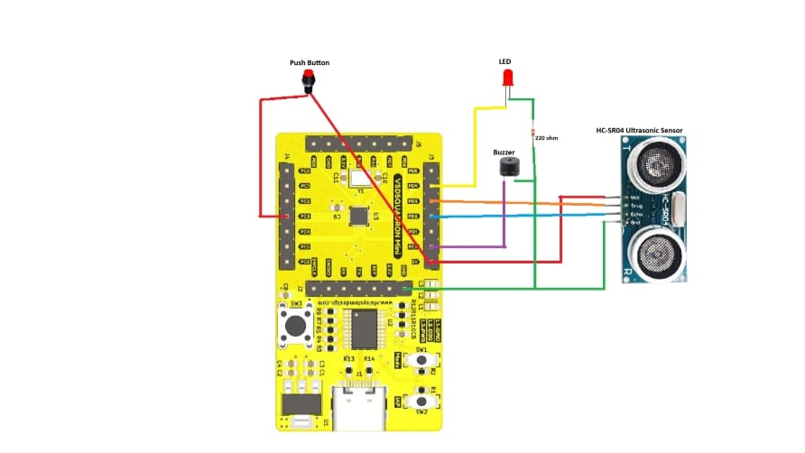

# Advanced Easy to Use Burglar Alarm Using VSD squadron mini

## Introduction
The *Advanced Easy to Use Burglar Alarm* is a compact and efficient security system designed for privacy-sensitive areas. It detects trespassing using an *HC-SR04 Ultrasonic Sensor* and alerts the user with a passive buzzer.

### Key Features:
- *Easy Installation:* Simply place it perpendicular to a solid surface.
- *Auto-Adjust Feature:* Self-calibrates within 10 seconds of activation.
- *Adaptable Range:* Detects objects *0.1 - 4 meters* from the surface.
- *Low Power Consumption:* Operates on *5V DC* via an adapter or battery bank.
- *Privacy-Friendly:* No cameras, ensuring personal privacy.

## Components Required
| Component                     | Quantity |
|--------------------------------|----------|
| VSD Squadron Mini Board       | 1        |
| HC-SR04 Ultrasonic Sensor     | 1        |
| Passive Buzzer                | 1        |
| Red LED                        | 1        |
| 220Ω Resistor                 | 1        |
| Toggle Switch                  | 1        |
| Breadboard                     | 1        |
| Male-to-Male Jumper Cables     | As needed |
| Male-to-Female Jumper Cables   | As needed |

## Circuit Diagram


## Pin Connections
| *HC-SR04 Sensor* | *VSD Squadron Mini* |
|--------------------|----------------------|
| VCC               | 5V                   |
| Trig              | PD3                   |
| Echo              | PD2                   |
| GND               | GND                   |

| *LED* | *Resistor* | *VSD Squadron Mini* |
|---------|-------------|----------------------|
| +       | -          | PD4                  |
| -       | 220Ω       | GND                  |

| *Buzzer* | *VSD Squadron Mini* |
|------------|----------------------|
| Pin 1      | PC7                  |
| Pin 2      | GND                  |

| *Button Switch* | *VSD Squadron Mini* |
|------------------|----------------------|
| Pin 1           | 5V                   |
| Pin 2           | PC3                   |

## Installation & Usage
1. *Assemble the circuit* as per the diagram.
2. *Upload the provided Arduino code* to the VSD Squadron Mini board.
3. *Power the device* using a *5V adapter* or *battery bank*.
4. *Wait for 10 seconds* as the system calibrates.
5. The buzzer will sound *if any object enters the detection zone*.

### HOW TO PROGRAM
-----

```c
#include "debug.h"

uint16_t distance;
uint16_t press;

void Input_Capture_Init(uint16_t arr, uint32_t psc)
{
    GPIO_InitTypeDef GPIO_InitStructure = {0};
    TIM_ICInitTypeDef TIM_ICInitStructure = {0};
    TIM_TimeBaseInitTypeDef TIM_TimeBaseInitStructure = {0};
    NVIC_InitTypeDef NVIC_InitStructure = {0};

    RCC_APB2PeriphClockCmd(RCC_APB2Periph_GPIOD | RCC_APB2Periph_GPIOC | RCC_APB2Periph_TIM1, ENABLE);

    GPIO_InitStructure.GPIO_Pin = GPIO_Pin_2;
    GPIO_InitStructure.GPIO_Mode = GPIO_Mode_IPD;
    GPIO_Init(GPIOD, &GPIO_InitStructure);
    GPIO_ResetBits(GPIOD, GPIO_Pin_2);

    GPIO_InitStructure.GPIO_Pin = GPIO_Pin_3;
    GPIO_InitStructure.GPIO_Mode = GPIO_Mode_IPD;
    GPIO_Init(GPIOC, &GPIO_InitStructure);

    GPIO_InitStructure.GPIO_Pin = GPIO_Pin_3 | GPIO_Pin_4;
    GPIO_InitStructure.GPIO_Mode = GPIO_Mode_Out_PP;
    GPIO_InitStructure.GPIO_Speed = GPIO_Speed_50MHz;
    GPIO_Init(GPIOD, &GPIO_InitStructure);

    GPIO_InitStructure.GPIO_Pin = GPIO_Pin_7;
    GPIO_InitStructure.GPIO_Mode = GPIO_Mode_Out_PP;
    GPIO_InitStructure.GPIO_Speed = GPIO_Speed_50MHz;
    GPIO_Init(GPIOC, &GPIO_InitStructure);

    TIM_TimeBaseInitStructure.TIM_Period = arr;
    TIM_TimeBaseInitStructure.TIM_Prescaler = psc;
    TIM_TimeBaseInitStructure.TIM_ClockDivision = TIM_CKD_DIV1;
    TIM_TimeBaseInitStructure.TIM_CounterMode = TIM_CounterMode_Up;
    TIM_TimeBaseInitStructure.TIM_RepetitionCounter = 0x00;
    TIM_TimeBaseInit(TIM1, &TIM_TimeBaseInitStructure);

    TIM_ICInitStructure.TIM_Channel = TIM_Channel_1;
    TIM_ICInitStructure.TIM_ICPrescaler = TIM_ICPSC_DIV1;
    TIM_ICInitStructure.TIM_ICFilter = 0x00;
    TIM_ICInitStructure.TIM_ICPolarity = TIM_ICPolarity_Rising;
    TIM_ICInitStructure.TIM_ICSelection = TIM_ICSelection_DirectTI;

    TIM_PWMIConfig(TIM1, &TIM_ICInitStructure);

    NVIC_InitStructure.NVIC_IRQChannel = TIM1_CC_IRQn;
    NVIC_InitStructure.NVIC_IRQChannelPreemptionPriority = 0;
    NVIC_InitStructure.NVIC_IRQChannelSubPriority = 1;
    NVIC_InitStructure.NVIC_IRQChannelCmd = ENABLE;
    NVIC_Init(&NVIC_InitStructure);

    TIM_ITConfig(TIM1, TIM_IT_CC1 | TIM_IT_CC2, ENABLE);

    TIM_SelectInputTrigger(TIM1, TIM_TS_TI1FP1);
    TIM_SelectSlaveMode(TIM1, TIM_SlaveMode_Reset);
    TIM_SelectMasterSlaveMode(TIM1, TIM_MasterSlaveMode_Enable);
    TIM_Cmd(TIM1, ENABLE);
}

uint16_t pressed(void){
    if(GPIO_ReadInputDataBit(GPIOC,GPIO_Pin_3)==1){
        Delay_Ms(500);
        GPIO_WriteBit(GPIOC,GPIO_Pin_7,SET);
        Delay_Ms(100);
        GPIO_WriteBit(GPIOC,GPIO_Pin_7,RESET);
        Delay_Ms(1000);
        press=!press;
    }
    return press;
}

int main(void)
{
    SystemCoreClockUpdate();
    Delay_Init();
    USART_Printf_Init(115200);
    Input_Capture_Init(0xFFFF, 48 - 1);
    uint32_t count=0;
    uint32_t value=0;
    uint16_t avg=0;
    
    while (pressed())
    {     
        GPIO_WriteBit(GPIOD, GPIO_Pin_3, SET);
        Delay_Us(10); 
        GPIO_WriteBit(GPIOD, GPIO_Pin_3, RESET);
        if(count<=4000){
            count+=1;
            GPIO_WriteBit(GPIOD,GPIO_Pin_4,SET);
            value+=distance;
            Delay_Ms(1);
        }else if(count==4001){
            avg = value/count;
            count+=1;
        }else if(count>4001 && count<4050){
            count+=1;
            Delay_Ms(1);
        }else{
            GPIO_WriteBit(GPIOD,GPIO_Pin_4,RESET);
            if(distance<avg-10 || distance>avg+10){
                count=0;
                while(pressed()){
                    GPIO_WriteBit(GPIOC,GPIO_Pin_7,SET);
                    GPIO_WriteBit(GPIOD,GPIO_Pin_4,SET);
                    Delay_Ms(500);
                    GPIO_WriteBit(GPIOC,GPIO_Pin_7,RESET);
                    GPIO_WriteBit(GPIOD,GPIO_Pin_4,RESET);
                    Delay_Ms(500);
                }
            }
        }  
    }
}

