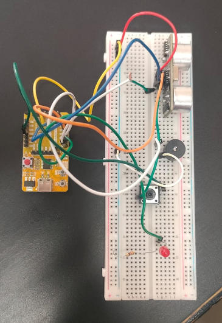
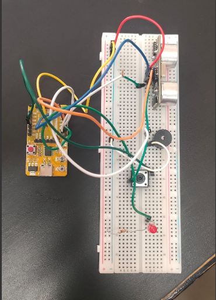

# Advanced & Easy-to-Use Burglar Alarm Using VSDSquadron Mini  

## 1. System Overview  
The **Burglar Alarm System** using the **VSDSquadron Mini** and an **Ultrasonic Sensor** works by detecting motion or unauthorized entry using distance measurement. If an intrusion is detected, an alarm (buzzer + LED) is activated.  

---

## 2. System Components & Connections  

### **Required Components**
- **Ultrasonic Sensor (HC-SR04)**: Measures distance by sending ultrasonic pulses.
- **Buzzer (PC6)**: Sounds an alarm when motion is detected.
- **LED (PC5)**: Indicates alarm status.
- **Push Button (PD3)**: Used to arm/disarm the alarm system.
- **Power Supply**: USB-powered (5V).  

### **GPIO Pin Configuration**  

| **Component**         | **Pin on VSDSquadron Mini** | **Direction** | **Function** |
|----------------------|--------------------------|--------------|--------------|
| Ultrasonic Sensor TRIG | PD1 | Output | Sends trigger pulse |
| Ultrasonic Sensor ECHO | PD2 | Input | Receives echo signal |
| Push Button (Toggle Alarm) | PD3 | Input (Pull-up) | Turns the alarm ON/OFF |
| Buzzer | PC6 | Output | Sounds an alarm |
| LED (Status) | PC5 | Output | Visual indicator |

---

## 3. Working Principle  

### **Step 1: System Initialization**  
- On power-up, the system **initializes** all components.  
- The **push button** is used to toggle the alarm system ON/OFF.  
- The **ultrasonic sensor** continuously measures distance.  

### **Step 2: Motion/Intruder Detection**  
- The **Ultrasonic Sensor** works by:  
  1. Sending an **ultrasonic pulse** via the TRIG pin.  
  2. Receiving the reflected signal on the **ECHO** pin.  
  3. Calculating the **distance** to the nearest object.  

- If the detected **distance is below a threshold** (e.g., < 50 cm), the system detects **motion or intrusion**.  

### **Step 3: Alarm Activation**  
- If motion is detected while the **alarm is armed**, the system:  
  - **Turns ON the Buzzer (PC6)** 🚨  
  - **Turns ON the LED (PC5) as a warning indicator** 🔴  
  - The alarm remains active until the system is **disarmed via the push button** or the motion stops.  

### **Step 4: Reset & Toggle Alarm**  
- Pressing the **push button (PD3)** again will **disarm the alarm**, turning **OFF** the buzzer and LED.  

---

## 4. Advantages  
✅ **Contactless Detection:** Uses ultrasonic waves, no physical sensors needed.  
✅ **User-Friendly:** Simple push-button interface for arming/disarming.  
✅ **Reliable:** Works in various lighting conditions, unlike IR sensors.  
✅ **Low Power Consumption:** Efficient use of the VSDSquadron Mini’s GPIOs.  

---

## Code Implementation**  

    #include "debug.h"

    uint16_t distance;
    uint16_t press;

    void Input_Capture_Init(uint16_t arr, uint32_t psc)
    {
    GPIO_InitTypeDef        GPIO_InitStructure = {0};
    TIM_ICInitTypeDef       TIM_ICInitStructure = {0};
    TIM_TimeBaseInitTypeDef TIM_TimeBaseInitStructure = {0};
    NVIC_InitTypeDef        NVIC_InitStructure = {0};

    RCC_APB2PeriphClockCmd(RCC_APB2Periph_GPIOD | RCC_APB2Periph_GPIOC | RCC_APB2Periph_TIM1, ENABLE);

    GPIO_InitStructure.GPIO_Pin = GPIO_Pin_2;
    GPIO_InitStructure.GPIO_Mode = GPIO_Mode_IPD;
    GPIO_Init(GPIOD, &GPIO_InitStructure);
    GPIO_ResetBits(GPIOD, GPIO_Pin_2);

    GPIO_InitStructure.GPIO_Pin = GPIO_Pin_3;
    GPIO_InitStructure.GPIO_Mode = GPIO_Mode_IPD;
    GPIO_Init(GPIOC, &GPIO_InitStructure);

    GPIO_InitStructure.GPIO_Pin = GPIO_Pin_3 | GPIO_Pin_4;
    GPIO_InitStructure.GPIO_Mode = GPIO_Mode_Out_PP;
    GPIO_InitStructure.GPIO_Speed = GPIO_Speed_50MHz;
    GPIO_Init(GPIOD, &GPIO_InitStructure);

    GPIO_InitStructure.GPIO_Pin = GPIO_Pin_7;
    GPIO_InitStructure.GPIO_Mode = GPIO_Mode_Out_PP;
    GPIO_InitStructure.GPIO_Speed = GPIO_Speed_50MHz;
    GPIO_Init(GPIOC, &GPIO_InitStructure);

    TIM_TimeBaseInitStructure.TIM_Period = arr;
    TIM_TimeBaseInitStructure.TIM_Prescaler = psc;
    TIM_TimeBaseInitStructure.TIM_ClockDivision = TIM_CKD_DIV1;
    TIM_TimeBaseInitStructure.TIM_CounterMode = TIM_CounterMode_Up;
    TIM_TimeBaseInitStructure.TIM_RepetitionCounter = 0x00;
    TIM_TimeBaseInit(TIM1, &TIM_TimeBaseInitStructure);

    TIM_ICInitStructure.TIM_Channel = TIM_Channel_1;
    TIM_ICInitStructure.TIM_ICPrescaler = TIM_ICPSC_DIV1;
    TIM_ICInitStructure.TIM_ICFilter = 0x00;
    TIM_ICInitStructure.TIM_ICPolarity = TIM_ICPolarity_Rising;
    TIM_ICInitStructure.TIM_ICSelection = TIM_ICSelection_DirectTI;

    TIM_PWMIConfig(TIM1, &TIM_ICInitStructure);

    NVIC_InitStructure.NVIC_IRQChannel = TIM1_CC_IRQn;
    NVIC_InitStructure.NVIC_IRQChannelPreemptionPriority = 0;
    NVIC_InitStructure.NVIC_IRQChannelSubPriority = 1;
    NVIC_InitStructure.NVIC_IRQChannelCmd = ENABLE;
    NVIC_Init(&NVIC_InitStructure);

    TIM_ITConfig(TIM1, TIM_IT_CC1 | TIM_IT_CC2, ENABLE);

    TIM_SelectInputTrigger(TIM1, TIM_TS_TI1FP1);
    TIM_SelectSlaveMode(TIM1, TIM_SlaveMode_Reset);
    TIM_SelectMasterSlaveMode(TIM1, TIM_MasterSlaveMode_Enable);
    TIM_Cmd(TIM1, ENABLE);
    }

    uint16_t pressed(void){
    if(GPIO_ReadInputDataBit(GPIOC,GPIO_Pin_3)==1){
        Delay_Ms(500);
        GPIO_WriteBit(GPIOC,GPIO_Pin_7,SET);
        Delay_Ms(100);
        GPIO_WriteBit(GPIOC,GPIO_Pin_7,RESET);
        Delay_Ms(1000);
        press=!press;
    }
    return press;
    }

    int main(void)
    {
    SystemCoreClockUpdate();
    Delay_Init();
    USART_Printf_Init(115200);
    Input_Capture_Init(0xFFFF, 48 - 1);
    uint32_t count=0;
    uint32_t value=0;
    uint16_t avg=0;
    
    while (pressed())
    {     
        GPIO_WriteBit(GPIOD, GPIO_Pin_3, SET);
        Delay_Us(10); 
        GPIO_WriteBit(GPIOD, GPIO_Pin_3, RESET);
        if(count<=4000){
            count+=1;
            GPIO_WriteBit(GPIOD,GPIO_Pin_4,SET);
            value+=distance;
            Delay_Ms(1);
        }else if(count==4001){
            avg = value/count;
            GPIO_WriteBit(GPIOC,GPIO_Pin_7,SET);
            Delay_Ms(100);
            GPIO_WriteBit(GPIOC,GPIO_Pin_7,RESET);
            Delay_Ms(100);
            GPIO_WriteBit(GPIOC,GPIO_Pin_7,SET);
            Delay_Ms(100);
            GPIO_WriteBit(GPIOC,GPIO_Pin_7,RESET);
            Delay_Ms(100);
            count+=1;
        }else if(count>4001 && count<4050){
            count+=1;
            Delay_Ms(1);
        }else{
            GPIO_WriteBit(GPIOD,GPIO_Pin_4,RESET);
            if(distance<avg-10 || distance>avg+10){
                count=0;
                while(pressed()){
                    GPIO_WriteBit(GPIOC,GPIO_Pin_7,SET);
                    GPIO_WriteBit(GPIOD,GPIO_Pin_4,SET);
                    Delay_Ms(500);
                    GPIO_WriteBit(GPIOC,GPIO_Pin_7,RESET);
                    GPIO_WriteBit(GPIOD,GPIO_Pin_4,RESET);
                    Delay_Ms(500);
                }
            }
        }  
    }
    }

    void TIM1_CC_IRQHandler(void) __attribute__((interrupt("WCH-Interrupt-fast")));

    void TIM1_CC_IRQHandler(void)
    {
    if (TIM_GetITStatus(TIM1, TIM_IT_CC1) != RESET)
    {
        TIM_SetCounter(TIM1,0);
    }

    if (TIM_GetITStatus(TIM1, TIM_IT_CC2) != RESET)
    {
        uint32_t duration = TIM_GetCapture1(TIM1);
        distance = duration*0.034/2;
        printf("%d\n",distance);
    }

    TIM_ClearITPendingBit(TIM1, TIM_IT_CC1 | TIM_IT_CC2);
    }
----

IMAGE1

IMAGE2

[VIDEO LINK](https://drive.google.com/file/d/1lJRIyfwKi9c_foxtRzaHJsgNivz723Fg/view?usp=drivesdk )

